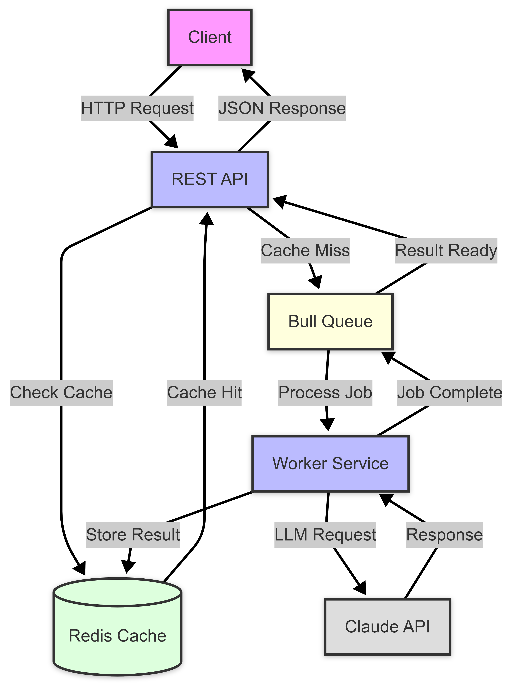

# 🤖 AI Text Processing and Enhancement Service


> by Preslav Dimitrov 

## 📖 Overview

A TypeScript-based application for text processing using Anthropic's Claude LLM. 
> ⚠️ **Note:** Currently I did Anthropic's Claude, but additional LLM providers in future can be added. Didn't have credits for my api-key, so I mocked the responses.

It utilizes Redis queues for asynchronous processing and features a scalable architecture that can be extended to support multiple LLM providers in the future.

## ⚙️ Architecture



## 🚀 Getting Started

### Prerequisites

- Node.js ≥ 18.0.0
- Redis
- Docker & Docker Compose
- Anthropic API key

### Installation

1. Clone the repository:
```bash
git clone git@github.com:dim8080/assignment-ai.git

cd assignment-ai
```

2. Install dependencies:
```bash
npm install
```

3. Copy `.env.example` to `.env`:
```bash
cp .env.example .env.dev
```

4. Fill in your settings in the `.env` file:
```bash
ANTHROPIC_API_KEY=your-api-key-here
```

### 🏃‍♂️ Running the Application

Development mode:
```bash
npm run dev
```

With Docker:
```bash
docker-compose -f docker-compose.dev.yml up
```

## 📦 Core Dependencies

- `express`: Web framework
- `@anthropic-ai/sdk`: Anthropic Claude API client
- `bull`: Redis-based queue
- `dotenv`: Environment variables management
- `typescript`: Typed JavaScript

## 🛠️ NPM Scripts

- `npm run dev`: Start the application in development mode
- `npm run build`: Compile TypeScript
- `npm start`: Run the production version
- `npm run lint`: Not implemented... TODO
- `npm test`: Not implemented... TODO

## 🔄 How It Works

1. **API Requests**: The application accepts HTTP requests for text processing
2. **Queue**: Requests are added to a Redis queue for asynchronous processing
3. **Processing**: Text is processed through Claude API
4. **Results**: Processed text is returned to the client

## 📡 API Endpoints

### Text Improvement
- `GET /api/v1/improve`
  
  Processes and improves the provided text using Claude.

  **Query Parameters:**
  - `text`: The text to be improved

  **Response:**
  ```json
  {
    "jobId": "14",
    "status": 200,
    "message": "Text processing started",
    "originalText": "wha t neets tu be editttterd?"
  }
  ```

### Job Status
- `GET /api/v1/status/:jobId`
  
  Returns the current status of a specific job.

  **Parameters:**
  - `jobId`: The ID of the job to check

  **Response:**
  ```json
  {
    "jobId": "14",
    "status": "pending...",
    "result": {
      "original": "wha t neets tu be editttterd?",
      "improved": "What needs to be edited?",
      "changes": [
        {
          "type": "style",
          "original": "wha t neets tu be editttterd?",
          "improved": "What needs to be edited?",
          "explanation": "Corrected spelling and grammar for clarity"
        }
      ]
    }
  }
  ```

### Processing History
- `GET /api/v1/history`
  
  Returns the history of processed texts.

  **Response:**
  ```json
  {
    "history": [
      {
        "jobId": "15",
        "text": "wha t neets tu be editttterd?",
        "status": "completed",
        "timestamp": 1739747642452,
        "result": {
          "original": "wha t neets tu be editttterd?",
          "improved": "What needs to be edited?",
          "changes": [
            {
              "type": "style",
              "original": "wha t neets tu be editttterd?",
              "improved": "What needs to be edited?",
              "explanation": "Corrected spelling and grammar for clarity"
            }
          ]
        }
      },
      {
        "jobId": "14
        ...
      }
    ]
  }
  ```

### Queue Dashboard
- `GET /admin/queues`
  
  Provides access to the Bull Queue dashboard for monitoring and managing jobs.

  **Note:** This endpoint serves a web interface.

  **Features:**
  - Real-time queue monitoring
  - Job status tracking
  - Failed jobs management
  - Performance metrics
  - Queue operations (pause, resume, clean)

## 🔒 Security

- Implements rate limiting for API requests
- Supports environment-based configuration

## 🚧 Future Improvements

- Support for multiple LLM providers
- Response caching
- Streaming responses
- Advanced error handling and retries
- Webhook notifications


## 📝 License

This project is licensed under the MIT License - see the [LICENSE](LICENSE) file for details. 